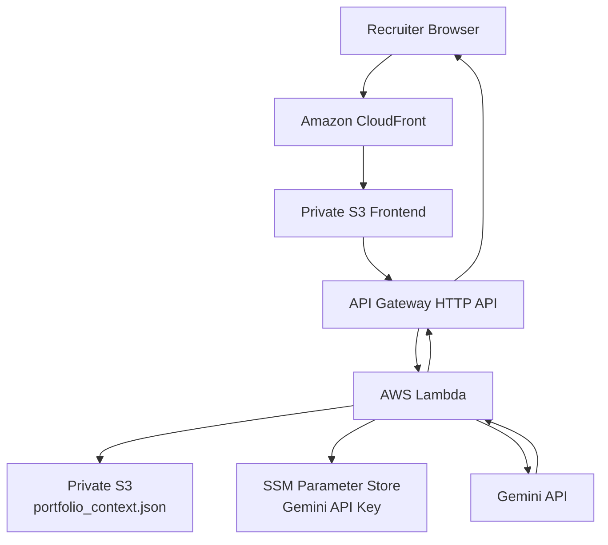

# AI Portfolio Assistant on AWS

A recruiter-facing AI portfolio assistant that answers questions about my cloud infrastructure experience, technical skills, and hands-on projects.

The application is hosted on AWS and provisioned with Terraform. Portfolio data is stored privately in Amazon S3, the frontend is delivered through CloudFront, and an API Gateway + Lambda backend sends grounded prompts to the Gemini API.

## Architecture



## What This Project Demonstrates

- **Infrastructure as Code** with Terraform
- **Static frontend delivery** using CloudFront and a private S3 origin
- **Origin Access Control (OAC)** instead of a public S3 website
- **Serverless API** using API Gateway HTTP API and AWS Lambda
- **Private portfolio data** loaded from S3 at runtime
- **Secret management** with SSM Parameter Store
- **LLM integration** through the Gemini REST API
- **Context-grounded answers** to reduce unsupported or invented claims
- **GitHub Actions + AWS OIDC** for Terraform deployment without long-lived AWS access keys
- **API throttling and budget alerts** as cost-abuse guardrails
- **Markdown rendering with sanitization** for safer AI-generated output

## Request Flow

1. A user opens the portfolio assistant through CloudFront.
2. CloudFront serves `frontend/index.html` from a private S3 bucket.
3. The browser sends a `POST /ask` request to API Gateway.
4. API Gateway invokes Lambda.
5. Lambda:
   - validates the question,
   - loads `portfolio_context.json` from private S3,
   - retrieves the Gemini API key from SSM Parameter Store,
   - builds a grounded prompt,
   - calls the Gemini API.
6. The answer is returned to the browser and rendered as sanitized Markdown.

## Security and Cost Guardrails

### Private frontend origin

The frontend S3 bucket blocks public access. CloudFront accesses the bucket through **Origin Access Control (OAC)**.

### Private portfolio data

`portfolio_context.json` is stored in a separate private S3 bucket. Lambda receives only `s3:GetObject` access to the portfolio data.

### API key management

The Gemini API key is not stored in source code. Lambda retrieves it from SSM Parameter Store at runtime.

### Input and output limits

The backend limits recruiter questions to **500 characters**.

Gemini generation is also limited:

```text
maxOutputTokens = 300
temperature     = 0.2
```

### API throttling

The API Gateway stage currently uses:

```text
Rate limit  : 2 requests/second
Burst limit : 5 requests
```

Requests exceeding the configured throttle return:

```text
429 Too Many Requests
```

### Error handling

The Lambda function handles invalid input and upstream AI-service failures instead of exposing raw exceptions.

Examples include:

- `400` — invalid or missing question
- `502` — upstream AI service unavailable
- `503` — Gemini rate limit / temporary service pressure
- `500` — unexpected backend error

### AWS Budget

Terraform also provisions a monthly AWS Budget as an additional cost-monitoring guardrail.

## Frontend

The frontend is intentionally lightweight and recruiter-focused.

It includes:

- suggested questions,
- English and Japanese questions,
- chat-style messages,
- a 500-character browser-side input limit,
- Markdown rendering with `marked`,
- HTML sanitization with `DOMPurify`,
- friendly handling for API throttling.

Example questions:

```text
What AWS experience does Itsuki have?

Does Itsuki have Terraform experience?

Which project best demonstrates automation?
```

## Validation

The following paths were tested during development:

| Test | Result |
|---|---|
| Browser → CloudFront → S3 frontend | Passed |
| Browser → API Gateway → Lambda | Passed |
| Lambda → private S3 context | Passed |
| Lambda → SSM Parameter Store | Passed |
| Lambda → Gemini API | Passed |
| English recruiter question | Passed |
| Japanese recruiter question | Passed |
| Markdown rendering | Passed |
| Concurrent API throttling test | `429 Too Many Requests` observed |
| Gemini rate-limit handling | Controlled `503` response observed |
| Terraform deployment through GitHub Actions | Passed |

Recent Terraform CI run:

https://github.com/itsuki-kawamura-dev/terraform-aws-ai-portfolio-assistant/actions/runs/36308909020

## CI/CD

Deployment is handled by a manually triggered GitHub Actions workflow.

```text
workflow_dispatch
      ↓
GitHub OIDC
      ↓
AWS IAM Role
      ↓
terraform fmt
      ↓
terraform init
      ↓
terraform validate
      ↓
terraform plan
      ↓
terraform apply
```

A separate manual workflow is included for Terraform destroy operations.

## Repository Structure

```text
.
├── .github/
│   └── workflows/
│       ├── main.yml
│       └── destroy.yml
│
├── data/
│   └── portfolio_context.json
│
├── frontend/
│   └── index.html
│
├── lambda/
│   └── app.py
│
└── terraform/
    ├── api_gateway.tf
    ├── budget.tf
    ├── frontend.tf
    ├── iam.tf
    ├── lambda.tf
    ├── main.tf
    ├── output.tf
    ├── s3.tf
    └── variables.tf
```

## Terraform Outputs

After deployment:

```bash
terraform output api_endpoint
terraform output portfolio_url
```

`portfolio_url` returns the CloudFront URL for the recruiter-facing frontend.

## Required External Configuration

Before deployment, the following values must exist outside the repository:

- an AWS IAM role that GitHub Actions can assume through OIDC,
- the GitHub Actions `IAM_ROLE_ARN` configuration,
- an existing S3 bucket for Terraform remote state,
- an SSM SecureString parameter:

```text
/portfolio-assistant/gemini-api-key
```

The API key itself is never committed to the repository.

## Design Note

The project originally explored Amazon Bedrock for the LLM layer. During implementation, account-level Bedrock inference quotas prevented model invocation, so the application was adapted to use the Gemini API while retaining the AWS serverless architecture.

This keeps the LLM provider replaceable while allowing the rest of the AWS infrastructure, security controls, and deployment workflow to remain unchanged.

## Future Improvements

Planned improvements include:

- automatically synchronizing GitHub project README files into the portfolio knowledge source,
- linking AI answers directly to relevant GitHub projects,
- retrieving only the most relevant project context as the knowledge base grows,
- improving the frontend UI,
- adding additional observability and request metrics,
- reintroducing Amazon Bedrock as an alternative provider if account inference access becomes available.

---

Built as a hands-on cloud infrastructure project using **AWS, Terraform, GitHub Actions, Python, and an external LLM API**.
