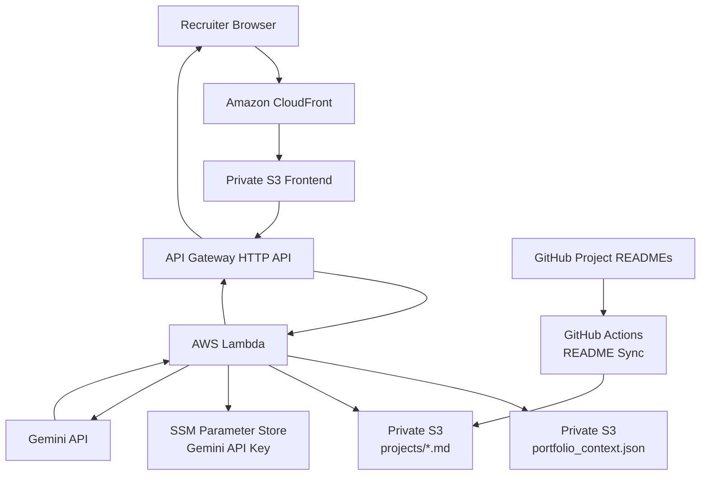

# AI Portfolio Assistant on AWS

A recruiter-facing AI portfolio assistant that answers questions about my cloud infrastructure experience, technical skills, and hands-on projects.

The application is hosted on AWS and provisioned with Terraform. The frontend is delivered through CloudFront from a private S3 origin, API Gateway and Lambda handle recruiter questions, portfolio data is loaded from private S3, and Gemini generates grounded responses from curated portfolio context and synchronized GitHub project READMEs.

## Architecture



## What This Project Demonstrates

- **Infrastructure as Code** with Terraform
- **Static frontend delivery** using CloudFront and a private S3 origin
- **Origin Access Control (OAC)** instead of a public S3 website
- **Serverless API** using API Gateway HTTP API and AWS Lambda
- **Private portfolio data** loaded from S3 at runtime
- **Secret management** with SSM Parameter Store
- **LLM integration** through the Gemini REST API
- **Context-grounded answers** to reduce unsupported or invented claims
- **Project-aware context selection** so relevant README content is loaded only when useful
- **Automatic GitHub README synchronization** into the portfolio knowledge source
- **Direct links to relevant GitHub projects** in AI responses
- **GitHub Actions + AWS OIDC** for Terraform deployment without long-lived AWS access keys
- **API throttling and AWS Budget alerts** as cost-abuse guardrails
- **Markdown rendering with sanitization** for safer AI-generated output

## Request Flow

1. A recruiter opens the portfolio assistant through CloudFront.
2. CloudFront serves `frontend/index.html` from a private S3 bucket.
3. The browser sends a `POST /ask` request to API Gateway.
4. API Gateway invokes Lambda.
5. Lambda validates the question and loads the general portfolio context from `portfolio_context.json`.
6. Lambda performs lightweight keyword-based project selection and loads up to two relevant project README files from S3.
7. Lambda retrieves the Gemini API key from SSM Parameter Store.
8. The general context, selected project context, and recruiter question are sent to Gemini.
9. Gemini returns a concise answer in the same language as the question and, when relevant, includes a Markdown link to the associated GitHub repository.
10. The frontend renders the response as sanitized Markdown.

## Project Knowledge Synchronization

Project READMEs are synchronized from GitHub into private S3 by a dedicated GitHub Actions workflow.

The workflow currently syncs these repositories:

```text
terraform-aws-private-ec2-ssm
terraform-aws-cloudwatch-alarm-sns
terraform-aws-github-actions-oidc-ci
terraform-aws-ansible-docker-alb
terraform-azure-private-vm
terraform-aws-windows-maintenance-automation
terraform-aws-ai-portfolio-assistant
```

The synchronized S3 structure is:

```text
portfolio-assistant-data/
├── portfolio_context.json
└── projects/
    ├── terraform-aws-private-ec2-ssm.md
    ├── terraform-aws-cloudwatch-alarm-sns.md
    ├── terraform-aws-github-actions-oidc-ci.md
    ├── terraform-aws-ansible-docker-alb.md
    ├── terraform-azure-private-vm.md
    ├── terraform-aws-windows-maintenance-automation.md
    └── terraform-aws-ai-portfolio-assistant.md
```

Each synchronized file includes the source repository URL before the README content. The prompt instructs the model to use only repository URLs provided in the retrieved context, so relevant answers can link directly to the source project without inventing URLs.

## Lightweight Project Routing

The current implementation intentionally avoids a vector database or full RAG stack.

For the current portfolio size, Lambda performs lightweight keyword scoring against the recruiter question and selects at most two project READMEs:

```text
Recruiter question
        ↓
Keyword scoring
        ↓
Select up to 2 relevant projects
        ↓
Load matching README files from S3
        ↓
General portfolio context + project context
        ↓
Gemini
```

This keeps the architecture simple and reduces unnecessary LLM input compared with sending every project README on every request.

## Security and Cost Guardrails

### Private frontend origin

The frontend S3 bucket blocks public access. CloudFront accesses the bucket through **Origin Access Control (OAC)**.

### Private portfolio knowledge

`portfolio_context.json` and synchronized project READMEs are stored in a separate private S3 bucket. Lambda receives `s3:GetObject` access to the portfolio data.

### API key management

The Gemini API key is not stored in application source code. Lambda retrieves it from SSM Parameter Store at runtime.

### Input and output limits

Recruiter questions are limited to **500 characters** in both the frontend and backend.

Gemini generation is also limited:

```text
maxOutputTokens = 300
temperature     = 0.2
```

Project context is also bounded:

```text
Maximum selected projects : 2
Maximum README characters : 12,000 per selected project
```

### API throttling

The API Gateway stage currently uses:

```text
Rate limit  : 2 requests/second
Burst limit : 5 requests
```

Requests exceeding the configured throttle return:

```text
429 Too Many Requests
```

### Error handling

The Lambda function handles invalid input and upstream AI-service failures instead of exposing raw exceptions.

Examples include:

- `400` — invalid or missing question
- `502` — upstream AI service unavailable
- `503` — Gemini rate limit / temporary service pressure
- `500` — unexpected backend error

### AWS Budget

Terraform provisions a monthly AWS Budget with notifications as an additional cost-monitoring guardrail.

The notification email is provided to Terraform through a GitHub Actions secret via `TF_VAR_budget_notification_email` rather than being committed to the repository.

## Frontend

The frontend is intentionally lightweight and recruiter-focused.

It includes:

- suggested questions,
- English and Japanese questions,
- chat-style messages,
- a 500-character browser-side input limit,
- Markdown rendering with `marked`,
- HTML sanitization with `DOMPurify`,
- clickable links to relevant GitHub projects,
- friendly handling for API throttling.

Example questions:

```text
What AWS experience does Itsuki have?

How did Itsuki use Azure Private Endpoint?

Which project demonstrates Windows automation?

Does Itsuki have CloudWatch monitoring experience?
```

## Validation

The following paths were tested during development:

| Test | Result |
|---|---|
| Browser → CloudFront → S3 frontend | Passed |
| Browser → API Gateway → Lambda | Passed |
| Lambda → private S3 portfolio context | Passed |
| Lambda → synchronized project README context | Passed |
| Lambda → SSM Parameter Store | Passed |
| Lambda → Gemini API | Passed |
| English recruiter question | Passed |
| Japanese recruiter question | Passed |
| Project-aware README selection | Passed |
| GitHub project link returned in AI answer | Passed |
| Markdown rendering | Passed |
| Concurrent API throttling test | `429 Too Many Requests` observed |
| Gemini rate-limit handling | Controlled `503` response observed |
| Terraform deployment through GitHub Actions | Passed |
| Scheduled/manual project README synchronization | Passed |

## CI/CD

Terraform deployment is handled by a manually triggered GitHub Actions workflow.

```text
workflow_dispatch
      ↓
GitHub OIDC
      ↓
AWS IAM Role
      ↓
terraform fmt
      ↓
terraform init
      ↓
terraform validate
      ↓
terraform plan
      ↓
terraform apply
```

A separate manual workflow is included for Terraform destroy operations.

Project README synchronization runs through a separate workflow:

```text
workflow_dispatch or daily schedule
      ↓
GitHub OIDC
      ↓
AWS IAM Role
      ↓
Fetch public project READMEs
      ↓
Add repository metadata
      ↓
Upload to private S3 projects/
```

## Repository Structure

```text
.
├── .github/
│   └── workflows/
│       ├── main.yml
│       ├── destroy.yml
│       └── sync-project-readmes.yml
│
├── data/
│   └── portfolio_context.json
│
├── frontend/
│   └── index.html
│
├── lambda/
│   └── app.py
│
└── terraform/
    ├── api_gateway.tf
    ├── budget.tf
    ├── frontend.tf
    ├── iam.tf
    ├── lambda.tf
    ├── main.tf
    ├── output.tf
    ├── s3.tf
    └── variables.tf
```

## Terraform Outputs

After deployment:

```bash
terraform output api_endpoint
terraform output portfolio_url
```

`portfolio_url` returns the CloudFront URL for the recruiter-facing frontend.

## Required External Configuration

Before deployment, the following values must exist outside the repository:

- an AWS IAM role that GitHub Actions can assume through OIDC,
- GitHub Actions secret `IAM_ROLE_ARN`,
- GitHub Actions secret `YOUR_EMAIL_ADDRESS` for the AWS Budget notification,
- GitHub Actions variable `PORTFOLIO_BUCKET` for project README synchronization,
- an existing S3 bucket for Terraform remote state,
- an SSM SecureString parameter:

```text
/portfolio-assistant/gemini-api-key
```

The Gemini API key and budget notification email are not committed to the repository.

## Design Note

The project originally explored Amazon Bedrock for the LLM layer. During implementation, account-level Bedrock inference quotas prevented model invocation, so the application was adapted to use the Gemini API while retaining the AWS serverless architecture.

The application is therefore structured so the LLM provider can be changed without redesigning the frontend, API Gateway, S3 knowledge source, or deployment workflow.

The project also deliberately uses lightweight keyword-based project routing instead of introducing a vector database before the portfolio size requires one.

## Possible Future Improvements

The current implementation is considered a complete MVP. Potential future improvements include:

- replace keyword routing with semantic retrieval if the knowledge base grows,
- add request metrics and dashboards,
- add stronger abuse protection if the public endpoint receives meaningful traffic,
- improve frontend styling and mobile presentation,
- reintroduce Amazon Bedrock as an alternative LLM provider if account inference access becomes available.

---

Built as a hands-on cloud infrastructure project using **AWS, Terraform, GitHub Actions, Python, S3, CloudFront, API Gateway, Lambda, and an external LLM API**.
